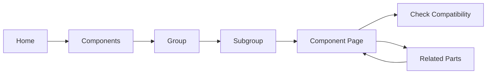
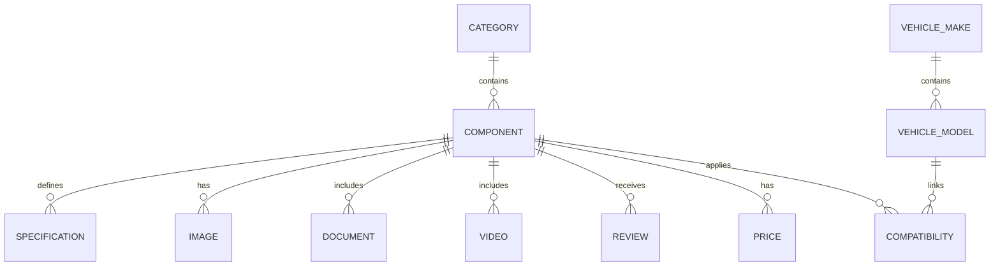

# "Automotive Components" Section

## Tone and format
- Tone: professional, trustworthy, informative.
- Language: precise automotive terms, explained in an accessible way.
- Format: SEO-friendly HTML5.
- Framework: no restriction.

## Taxonomy: groups and subgroups
- `Engine Mechanics`:
  - Filters (oil, air, fuel)
  - Ignition (spark plugs, coils)
  - Timing (belt, tensioner, pump)
  - Cooling (thermostat, water pump)
- `Braking System`:
  - Brake pads
  - Brake discs
  - Brake fluid
  - ABS sensors
- `Body & Chassis`:
  - Suspension
  - Steering
  - Lighting
  - Exterior panels
- `Electrical & Electronics`:
  - Battery
  - Alternator
  - Starter motor
  - Sensors and modules
- `Transmission & Clutch`:
  - Clutch kit
  - Dual-mass flywheel
  - CV joints
  - Gearbox lubrication

Rationale:
- Grouping by functional system helps diagnostics, compatibility checks, and purchase decisions.

## Information architecture
- Main menu:
  - Home
  - Components
  - Brands
  - Types
  - Compare
- Inside `Components`:
  - Breadcrumbs
  - Advanced search
  - Group taxonomy
  - Results grid
- Advanced filters:
  - Make
  - Model
  - Year
  - Category
  - Max price

## Component product template
Sections:
- Title
- Short/long description
- Technical specs (size, material, standard)
- Compatibility (make/model/year)
- Image gallery
- Technical diagram
- Related parts
- Price
- PDF downloads
- Videos
- Reviews

Required fields:
- SKU, name, category, subgroup, price, stock, description, specs, compatibility, primary image.

Optional fields:
- PDF, video, diagram, reviews, previous price, related products.

## UX/UI recommendations
- Mobile-first:
  - compact filter panel
  - clear card hierarchy
- Accessibility:
  - AA contrast
  - descriptive alt text
  - visible focus states
- Microinteractions:
  - hover states for links/buttons
  - feedback when filters are applied
- Performance:
  - image lazy loading
  - WebP compression
- Typography:
  - high-contrast headings
  - readable body text and line-height

## Relational data model (summary)
Entities:
- Category
- Component
- Specification
- Compatibility
- VehicleMake
- VehicleModel
- Image
- Document
- Video
- Review
- Price

Key relationships:
- Category 1:N Component
- Component 1:N Specification
- Component N:M Vehicle (Compatibility table)
- Component 1:N Image/Document/Video/Review

## Suggested REST endpoints
- `GET /api/components`
- `GET /api/components/{id}`
- `GET /api/categories`
- `GET /api/vehicles/makes`
- `GET /api/vehicles/models?make=...`
- `POST /api/search`
- `GET /api/components/{id}/compatibility`
- `GET /api/components/{id}/related`

## User flow (Mermaid)


## ER diagram (Mermaid)


## Realistic content examples
### Rear brake pads
- Material: semi-metallic ceramic
- Standard: ECE R90
- Dimensions: 123 x 52 x 16.2 mm
- Compatibility: Golf VII, A3 8V, Leon III

### Oil filter
- Thread: M20x1.5
- Standard: ISO 4548
- Height: 86 mm
- Compatibility: Corolla, CT200h, RAV4

## Suggested FAQs
- How do I verify compatibility?
- What is the difference between ceramic and metallic pads?
- Which standard should a brake disc meet?
- What happens if I install an equivalent reference?

## Testing checklist
- Functional:
  - search and filters
  - breadcrumb navigation
  - component page and related parts
- UX:
  - hierarchy clarity
  - time-to-find target product
- Performance:
  - lazy loading works
  - visual stability (no shifts)
  - initial render speed

## KPIs
- Conversion rate by category
- Advanced-filter usage rate
- Average time on component page
- CTR on "View product"
- Percentage of zero-result searches
- LCP and CLS on catalog/product pages

## Input/output example
Input:
- `car components: rear brakes`

Output JSON:
```json
{
  "query": "rear brakes",
  "category": "Braking System",
  "subgroup": "Brake Pads",
  "total": 1,
  "results": [
    {
      "id": "pb-452r",
      "sku": "PB-452R",
      "name": "ProBrake Ceramic Rear Brake Pads",
      "price": 69.9,
      "url": "/subPages/componente.html?id=pb-452r"
    }
  ]
}
```
